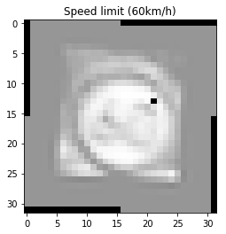

# **Traffic Sign Recognition**

## Writeup

### You can use this file as a template for your writeup if you want to submit it as a markdown file, but feel free to use some other method and submit a pdf if you prefer.

---

**Build a Traffic Sign Recognition Project**

The goals / steps of this project are the following:
* Load the data set (see below for links to the project data set)
* Explore, summarize and visualize the data set
* Design, train and test a model architecture
* Use the model to make predictions on new images
* Analyze the softmax probabilities of the new images
* Summarize the results with a written report


[//]: # (Image References)

[image1]: ./examples/visualization.jpg "Visualization"
[image2]: ./examples/grayscale.jpg "Grayscaling"
[image3]: ./examples/random_noise.jpg "Random Noise"
[image4]: ./examples/placeholder.png "Traffic Sign 1"
[image5]: ./examples/placeholder.png "Traffic Sign 2"
[image6]: ./examples/placeholder.png "Traffic Sign 3"
[image7]: ./examples/placeholder.png "Traffic Sign 4"
[image8]: ./examples/placeholder.png "Traffic Sign 5"

## Rubric Points
### Here I will consider the [rubric points](https://review.udacity.com/#!/rubrics/481/view) individually and describe how I addressed each point in my implementation.

---
### Writeup / README

#### 1. Provide a Writeup / README that includes all the rubric points and how you addressed each one. You can submit your writeup as markdown or pdf. You can use this template as a guide for writing the report. The submission includes the project code.

You're reading it! and here is a link to my [project code](https://github.com/moomou/CarND-Traffic-Sign-Classifier-Project/blob/master/Traffic_Sign_Classifier.ipynb)


### Data Set Summary & Exploration

#### 1. Provide a basic summary of the data set. In the code, the analysis should be done using python, numpy and/or pandas methods rather than hardcoding results manually.

I used the numpy library to calculate summary statistics of the traffic
signs data set:

* The size of training set is 34799
* The size of the validation set is 4410
* The size of test set is 12630
* The shape of a traffic sign image is (32, 32, 3)
* The number of unique classes/labels in the data set is 43

For details on the implementation, please see https://github.com/moomou/CarND-Traffic-Sign-Classifier-Project/blob/master/Traffic_Sign_Classifier.ipynb and https://github.com/moomou/CarND-Traffic-Sign-Classifier-Project/blob/master/script/data.py


#### 2. Include an exploratory visualization of the dataset.

Here is an exploratory visualization of the data set. It is a bar chart showing the distribution of the data


Sanity check on training inputs


### Design and Test a Model Architecture

#### 1. Describe how you preprocessed the image data. What techniques were chosen and why did you choose these techniques? Consider including images showing the output of each preprocessing technique. Pre-processing refers to techniques such as converting to grayscale, normalization, etc. (OPTIONAL: As described in the "Stand Out Suggestions" part of the rubric, if you generated additional data for training, describe why you decided to generate additional data, how you generated the data, and provide example images of the additional data. Then describe the characteristics of the augmented training set like number of images in the set, number of images for each class, etc.)

As a first step, after reading the (Traffic sign paper)[http://yann.lecun.com/exdb/publis/pdf/sermanet-ijcnn-11.pdf], I decided to use grayscale version of the image. As suggested by the lecture, I also applied normalization to each pixel. On further research, I found that scikit image provides histogram normalization to enhances contrast, which is applied to all images. Finally, I rescaled the bounding boxes and cropped out the sign. For data augmentation, I implemented rotation.

For detailed implementation, see https://github.com/moomou/CarND-Traffic-Sign-Classifier-Project/blob/master/script/data.py.

### Sample preprocessed images


### Sample preprocessed and augmented




#### 2. Describe what your final model architecture looks like including model type, layers, layer sizes, connectivity, etc.) Consider including a diagram and/or table describing the final model.

My final model consisted of the following layers and is built wih keras.

For the detailed implementation, please see https://github.com/moomou/CarND-Traffic-Sign-Classifier-Project/blob/master/script/model.py

```
Layer (type)                 Output Shape              Param #
===============================================================
x (InputLayer)               (None, 32, 32, 1)         0
_________________________________________________________________
conv2d_1 (Conv2D)            (None, 30, 30, 32)        320
_________________________________________________________________
conv2d_2 (Conv2D)            (None, 30, 30, 32)        1056
_________________________________________________________________
conv2d_3 (Conv2D)            (None, 28, 28, 32)        9248
_________________________________________________________________
max_pooling2d_1 (MaxPooling2 (None, 14, 14, 32)        0
_________________________________________________________________
conv2d_4 (Conv2D)            (None, 12, 12, 64)        18496
_________________________________________________________________
conv2d_5 (Conv2D)            (None, 12, 12, 64)        4160
_________________________________________________________________
conv2d_6 (Conv2D)            (None, 10, 10, 64)        36928
_________________________________________________________________
max_pooling2d_2 (MaxPooling2 (None, 5, 5, 64)          0
_________________________________________________________________
flatten_2 (Flatten)          (None, 1600)              0
_________________________________________________________________
dense_1 (Dense)              (None, 512)               819712
_________________________________________________________________
dropout_1 (Dropout)          (None, 512)               0
_________________________________________________________________
dense_2 (Dense)              (None, 512)               262656
_________________________________________________________________
dropout_2 (Dropout)          (None, 512)               0
_________________________________________________________________
dense_3 (Dense)              (None, 43)                22059
=================================================================
Total params: 1,174,635
Trainable params: 1,174,635
Non-trainable params: 0
```


#### 3. Describe how you trained your model. The discussion can include the type of optimizer, the batch size, number of epochs and any hyperparameters such as learning rate.

To train the model, I used the `fit_generator` with adam the optimizer using the default parameter for 360 epochs.

#### 4. Describe the approach taken for finding a solution and getting the validation set accuracy to be at least 0.93. Include in the discussion the results on the training, validation and test sets and where in the code these were calculated. Your approach may have been an iterative process, in which case, outline the steps you took to get to the final solution and why you chose those steps. Perhaps your solution involved an already well known implementation or architecture. In this case, discuss why you think the architecture is suitable for the current problem.

My final model results were:
* training set accuracy of 98.65%
* validation set accuracy of 98.30%
* test set accuracy of 97.35%

The final model was based on the LeNet model with the addition of 1x1 convolution sandwiched between 3x3 convolution layers. This was chosen based on the lectures as well as the (network in a network paper)[https://arxiv.org/pdf/1312.4400.pdf]. I have also applied dropout layers between the final classifier to guard against overfitting.

There were no parameter tunning as I used the default learning rate for adam. I used batch size of 32.

### Test a Model on New Images

#### 1. Choose five German traffic signs found on the web and provide them in the report. For each image, discuss what quality or qualities might be difficult to classify.

Here are five German traffic signs that I found on the web


These images are in general difficult to classify due to lack of cropping and varied lightning and weather conditions.

#### 2. Discuss the model's predictions on these new traffic signs and compare the results to predicting on the test set. At a minimum, discuss what the predictions were, the accuracy on these new predictions, and compare the accuracy to the accuracy on the test set (OPTIONAL: Discuss the results in more detail as described in the "Stand Out Suggestions" part of the rubric).

Here are the results of the prediction:

```
0 - No entry
1 - Children crossing
2 - End of no passing by vehicles over 3.5 metric tons
3 - Slippery road
4 - Yield
```

vs the real classes

```
0 - Speed limit (120km/h)
1 - Slippery road
2 - Yield
3 - Wild animals crossing
4 - Road work
```

The model was unable to classify any of the images correctly. This is due to the reason discussed above, including the lack of weather effects in training data as well as lack of cropping.

#### 3. Describe how certain the model is when predicting on each of the five new images by looking at the softmax probabilities for each prediction. Provide the top 5 softmax probabilities for each image along with the sign type of each probability. (OPTIONAL: as described in the "Stand Out Suggestions" part of the rubric, visualizations can also be provided such as bar charts)

The code for making predictions on my final model in https://github.com/moomou/CarND-Traffic-Sign-Classifier-Project/blob/master/script/eval.py


Top five predicted classes
```
0 - ['No entry', 'Traffic signals', 'Keep left', 'Go straight or left', 'Dangerous curve to the right']
1 - ['Children crossing', 'Right-of-way at the next intersection', 'Roundabout mandatory', 'Beware of ice/snow', 'General caution']
2 - ['End of no passing by vehicles over 3.5 metric tons', 'Right-of-way at the next intersection', 'Beware of ice/snow', 'End of speed limit (80km/h)', 'Yield']
3 - ['Slippery road', 'Bicycles crossing', 'Wild animals crossing', 'Dangerous curve to the right', 'Dangerous curve to the left']
4 - ['Yield', 'Keep right', 'Priority road', 'Speed limit (80km/h)', 'Speed limit (30km/h)']
```

Top five predicted class probabilies


```
### Print out the top five softmax probabilities for the predictions on the German traffic sign images found on the web.
### Feel free to use as many code cells as needed.
0 - [  9.67071891e-01   3.09022665e-02   2.02566455e-03   1.42201515e-07 7.65064812e-09]
1 - [ 0.61790299  0.15843105  0.11589437  0.05304716  0.04941824]
2 - [  5.28430641e-01   3.40315729e-01   1.31010354e-01   2.33766434e-04 9.32827879e-06]
3 - [  9.99218345e-01   7.18099705e-04   5.39329885e-05   4.69674706e-06 4.33345713e-06]
4 - [  9.96530592e-01   3.30713508e-03   1.32454938e-04   2.27800374e-05 4.49651270e-06]
```

As can be seen in the predicted probabilities, in general, the model is "very sure" of its predictions except case 1, which is a positive property given that the sign is partially obscured by snow.

### (Optional) Visualizing the Neural Network (See Step 4 of the Ipython notebook for more details)
#### 1. Discuss the visual output of your trained network's feature maps. What characteristics did the neural network use to make classifications?


The feature output from conv2d_3 is provided here


As can be clearly seen in the image, the filters in this layer is receptive to the shape of the sign and ignores other background information, proving the network is picking correct signals for classification.
